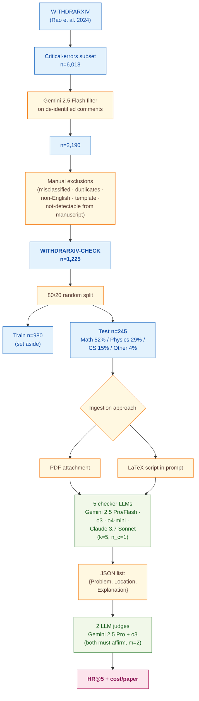

> [!success] **TL;DR**
> The paper makes a clean, well-instrumented case that today's reasoning LLMs — especially OpenAI's o3 and o4-mini — can flag the *specific* author-stated retraction error on roughly 60–70% of withdrawn math and physics papers, with o4-mini delivering nearly o3's accuracy at one-eighth the cost. The result that holds up cleanly is the cost–performance frontier within the OpenAI o-series.

## Structured abstract

> [!info] A plain-language summary built from this paper's discourse-graph nodes. Numbers and findings link back to specific EVD nodes — click any link to drill in.

### Question

Can today's top reasoning-style large language models (LLMs) — chatbots that "think step-by-step" before answering — actually catch the kinds of critical errors that get a scientific paper withdrawn? The authors test five proprietary reasoning LLMs as zero-shot manuscript quality checkers (no fine-tuning, just a single fixed prompt) on 245 real arXiv papers that authors withdrew because of factual or methodological errors. They also compare two ways of feeding the paper into the model: as a PDF attachment versus as the raw LaTeX source code. See [[QUE - Can reasoning LLMs identify critical errors and unsoundness problems in scientific papers?]].

### Methods

**Design.** The authors built a single cross-sectional benchmark in which five reasoning LLMs each reviewed the same 245 withdrawn arXiv papers under two ingestion conditions, with two separate LLMs serving as judges of whether the model's flagged problem matched the author's stated retraction reason.

**Tools.** The five "checker" models were Google's **Gemini 2.5 Pro** and **Gemini 2.5 Flash** (preview-04-17 and preview-05-06 — Google's flagship reasoning models, "Flash" is the cheaper sibling), OpenAI's **o3** and **o4-mini** (snapshot 2025-04-16 — OpenAI's reasoning models, "mini" is the cheaper sibling), and Anthropic's **Claude 3.7 Sonnet** (snapshot 20250219, with extended thinking enabled). All ran via official APIs in Python. The two "judge" models were Gemini 2.5 Pro and o3 (Claude was disqualified as a judge after performing too poorly as a checker). The dataset is **WITHDRARXIV-CHECK** — a curated subset of WITHDRARXIV (Rao et al. 2024), itself a corpus of papers withdrawn from arXiv with author-supplied retraction comments.

**Procedure.** The authors first built WITHDRARXIV-CHECK by filtering 6,018 candidate withdrawn papers down to 1,225 cases with clearly-specified, manuscript-detectable errors. They split this 80/20 into a 980-paper training set (set aside, not used) and a 245-paper test set. For each test paper, each checker LLM was prompted once with a fixed simplistic instruction asking for up to five critical problems, returned as JSON entries with fields Problem, Location, and Explanation. Each paper was given to the model two ways: as a PDF attachment, and as the raw LaTeX source pasted into the prompt. For papers without LaTeX source (12% of the test set), the LaTeX-row results re-used the model's PDF-row prediction. Each problem the checker submitted was then independently scored by the two judge LLMs, who saw the gold retraction comment and answered yes-or-no whether the checker had found the same problem. A paper counted as a "hit" only if both judges said yes — a stricter rule designed to resist the well-known LLM-judge inflation problem. The headline metric is Hit Rate at 5 (HR@5): the share of the 245 test papers on which the model scored at least one confirmed hit. The authors also tracked cost per paper at early-May-2025 API pricing.

**Sample.** No human subjects. Papers flowed from 6,018 WITHDRARXIV critical-error candidates, through a Gemini 2.5 Flash filter (down to 2,190), then a five-rule manual exclusion pass (misclassified, duplicate-version, non-English, template-like, or not-detectable-from-manuscript), to a final WITHDRARXIV-CHECK corpus of **1,225 papers**, randomly split into a **245-paper test set**. Test composition skews heavily toward formal sciences: Math 52%, Physics 29%, Computer Science 15%, Other 4%. Median page count was 14 (range 2–136); 88% had LaTeX source available.

### Findings

- **OpenAI o3 was the best error catcher overall.** o3 hit on 64.9% of papers when fed PDFs and 71.0% when fed LaTeX (HR@5 — share of test papers on which the model raised at least one judge-confirmed real error, out of 245). Its single-judge HR@5 ran higher (72.7% to 80.4%), and the dual-judge fusion is what brings the headline number down — evidence that the strict "both judges must agree" rule is doing real work against inflation. o3 also used markedly fewer thinking tokens than the Gemini family (3,152 vs. 14,228 for Gemini 2.5 Pro under PDF), so "more thinking" did not translate into "more hits". [[EVD - OpenAI o3 achieved the highest hit rate of 64.9% (PDF) and 71.0% (LaTeX) among all reasoning LLMs tested as scientific paper quality checkers - @zhangReviewingScientificPapers2025a]]

- **o4-mini wins on dollars-per-hit by a wide margin.** o4-mini reached 59.6% HR@5 on PDFs and 61.6% on LaTeX — only 5.3 to 9.4 percentage points behind o3 — but at $0.038 and $0.043 per paper, roughly **8.4 to 8.9 times cheaper** than o3 ($0.321 and $0.383 per paper). For anyone considering screening at scale, that cost ratio dominates the small accuracy gap. Both OpenAI models also gained from the LaTeX ingestion path, while the Gemini family slightly degraded under LaTeX — suggesting OpenAI's reasoning models received specialized LaTeX training. [[EVD - o4-mini achieved 59.6% HR@5 as a scientific paper quality checker at a cost of $0.038 per paper versus o3 at $0.321 per paper - @zhangReviewingScientificPapers2025a]]

- **Claude 3.7 Sonnet collapsed on PDF inputs.** When given PDFs, Claude returned an empty problem list on 64.9% of test papers and reached only 16.3% HR@5. Switching to LaTeX roughly doubled its hit rate to 33.1% and tripled the average problems submitted (1.6 to 3.4). Claude's PDF input-token usage was 9.3 times Gemini's and 2.6 times o3's — the authors trace this to Anthropic's PDF representation (per-page extracted text plus page image), suggesting the failure is a vendor-specific ingestion-pipeline problem, not a reasoning failure. The result was severe enough that the authors disqualified Claude from the judge pool. [[EVD - Claude 3.7 Sonnet found no problem in 64.9% of test papers and achieved only 16.3% hit rate as a PDF-based scientific quality checker - @zhangReviewingScientificPapers2025a]]

### Claim supported

These findings support the claim that [[CLM - Reasoning LLMs substantially outperform non-reasoning models at identifying critical scientific errors in papers and are viable as manuscript quality checkers]]. For someone considering deployment: o3 sets the current ceiling at roughly 7-in-10 papers caught when given LaTeX, o4-mini offers nearly the same accuracy at one-eighth the cost, and Claude's PDF pipeline is currently a non-starter for this use case. The authors frame the practical implication explicitly — these tools belong as a pre-screen feeding human reviewers, not as a replacement.

### Caveats

- **Only closed-source proprietary models were tested.** No open-source reasoning model (e.g., DeepSeek-R1, Qwen-QwQ, Llama-with-thinking variants) was evaluated, so we cannot tell whether o3's lead reflects reasoning-LLM capability in general or just one vendor's tooling. The Claude PDF collapse in particular looks more like a vendor pipeline issue than a model issue, and that hypothesis cannot be tested without open-source comparators. [[CVT - Only closed-source reasoning LLMs were evaluated as scientific paper quality checkers excluding open-source alternatives]]

- **The corpus is dominated by math and physics.** Math (52%) and physics (29%) papers together make up over 80% of the test set, and the kinds of "critical errors" in those fields tend to be formal — wrong equations, broken proofs, sign errors. Errors in empirical sciences (biology, medicine, social science) often hinge on study design, statistical analysis, or data quality, which look structurally different. The headline hit rates may not transfer. [[CVT - The error detection dataset was rich in math and physics papers and may not generalize to other scientific domains]]

### Methods at a glance

---

## Critical appraisal

> [!info] A risk-of-bias and validity assessment across five domains, synthesized from this paper's discourse-graph nodes. Each domain gets a rating (🟢 Low risk · 🟡 Some concerns · 🔴 High risk) plus a brief, EVD-grounded justification. The TRIPOD-LLM table below covers *reporting compliance*; this section covers *methodological quality*.

| Domain | Rating | Justification |
| --- | :---: | --- |
| **Construct validity** — does the metric actually measure the construct? | 🟡 | HR@5 measures whether the model surfaces *the specific error the author retracted the paper for* — a single gold problem per paper. A real quality-checker would also need to avoid raising false alarms on correct claims, but precision/false-positive rate is not reported. The "both judges affirm" rule is an explicit, defensible mitigation against LLM-judge inflation, and the gap between single-judge and dual-judge HR@5 (75.5% → 64.9% for o3) shows it is doing real work. |
| **Internal validity** — could the comparison be biased? | 🟡 | All checkers were evaluated on the same 245-paper test set with identical prompts and the same dual-judge fusion, which is clean. The judge pool, however, contains o3 — which is also one of the checkers — opening a potential self-preference path. The authors disqualified Claude from the judge pool *because* its checker performance was low, which is a defensible heuristic but means the judge pool is not neutral relative to the checker pool. No statistical-significance test is reported (TRIPOD-LLM 7e ⚠️). |
| **External validity** — do findings generalize? | 🔴 | Two compounding constraints. (1) Only closed-source proprietary models were tested — no open-source reasoning LLMs, and the Claude-PDF collapse is plausibly a vendor pipeline issue rather than a model-capability issue (see [[CVT - Only closed-source reasoning LLMs were evaluated as scientific paper quality checkers excluding open-source alternatives]]). (2) The corpus is 81% math and physics, where errors are formal (sign errors, broken proofs); empirical-science errors look structurally different and were barely sampled (see [[CVT - The error detection dataset was rich in math and physics papers and may not generalize to other scientific domains]]). The headline numbers should not be read as estimates for biomedical or social-science manuscript screening. |
| **Statistical rigor** — appropriate uncertainty + comparisons? | 🟡 | Point HR@5 estimates are reported but no confidence intervals are given on a 245-paper test set, no significance test on the o3-vs-o4-mini gap, and no multiple-comparison correction across 5 checkers × 2 ingestion approaches × 2 judge configurations. With n=245 and 2-class outcomes, a 5-percentage-point difference sits well inside binomial sampling noise. |
| **Reproducibility** — code, data, determinism? | 🟡 | API model snapshots are pinned (e.g., o3 `2025-04-16`, Claude `20250219`), inference settings are documented in Appendix B, and the prompt is in Appendix A. Closed-source APIs introduce irreducible nondeterminism — o3 and o4-mini do not support temperature or seed. Code and the WITHDRARXIV-CHECK dataset are *promised* as a future release at preprint time (TRIPOD-LLM 14e ⚠️ / 14f ⚠️) but not yet linked. |

**Bottom line.** The paper makes a clean, well-instrumented case that today's reasoning LLMs — especially OpenAI's o3 and o4-mini — can flag the *specific* author-stated retraction error on roughly 60–70% of withdrawn math and physics papers, with o4-mini delivering nearly o3's accuracy at one-eighth the cost. The result that holds up cleanly is the cost–performance frontier within the OpenAI o-series. The result that does *not* hold up cleanly is "reasoning LLMs are viable manuscript quality checkers" in general: the test bed is overwhelmingly formal-sciences, the false-positive rate is unmeasured, no open-source models are tested, and the Claude PDF result is more a story about Anthropic's PDF pipeline than about reasoning capability. Before deployment in a real journal-screening workflow, future work needs precision/recall on a domain-balanced corpus, open-source comparators, and a head-to-head against expert human reviewers on the same papers.

> [!tip] **Applicable external appraisal frameworks beyond TRIPOD-LLM** (already covered by the table below): **HELM** (Liang et al. 2022) for holistic LLM-evaluation principles · **Datasheets for Datasets** (Gebru et al. 2021) for the evaluation corpus · **Model Cards** (Mitchell et al. 2019) for the LLMs being evaluated

---

## TRIPOD-LLM reporting summary

> [!info] Reporting compliance for this paper, mapped to the TRIPOD-LLM checklist (Methods items 5a–15 and Results items 16a–18). Compliance icons: ✅ fully reported · ⚠️ partially reported / unclear · ❌ should be reported but not reported · ➖ not applicable to this study. Item 17 (Performance) is reported per-EVD; see each EVD's `## Other Notes`.

| # | Item | ✓ | Reported in this study |
| --- | --- | :---: | --- |
| **5a** | Data sources | ✅ | WITHDRARXIV (Rao et al. 2024) — papers withdrawn from arXiv by September 2024, with author retraction comments and well-defined retraction categories. Critical-errors subset filtered + manually curated into WITHDRARXIV-CHECK (n=1,225). |
| **5b** | Data points + distribution | ✅ | Train n=980 / Test n=245. Test composition: time span 2007–2012 13% / 2013–2018 47% / 2019–2024 40%; subject Math 52% / Physics 29% / CS 15% / Other 4%; median page count 14 (range 2–136); LaTeX source available 88%. Tabulated in Table 1. |
| **5c** | Date range of data | ⚠️ | Withdrawals through September 2024; retraction-comment time-span buckets reported, but earliest individual paper date and exact date of WITHDRARXIV-CHECK construction not given. API inference run early May 2025. |
| **5d** | Pre-processing / quality checks | ✅ | Two-stage filter: Gemini 2.5 Flash (`preview-04-17`) screens de-identified retraction comments to retain those clearly specifying the error (n=2,190); manual exclusion of (1) misclassified, (2) different versions of same paper, (3) non-English, (4) template-like reasons, (5) problems not detectable from manuscript alone; redacted theorem names manually corrected. Final n=1,225. |
| **5e** | Missing / imbalanced data | ⚠️ | Class imbalance not applicable (single positive task — every paper has a known error). For the 12% of test papers without LaTeX source, LaTeX-row results inherit the model's PDF-row prediction (acknowledged). No analysis of how exclusion criteria might bias remaining cases. |
| **6a** | LLM name + version | ✅ | Checkers: Gemini 2.5 Pro (`preview-05-06`); Gemini 2.5 Flash (`preview-04-17`); OpenAI o3 (`2025-04-16`); o4-mini (`2025-04-16`); Claude 3.7 Sonnet (`20250219`). Judges: Gemini 2.5 Pro (`preview-05-06`) and o3 (`2025-04-16`). All accessed via official APIs in Python. |
| **6b** | Development process | ➖ | No model development / fine-tuning. Off-the-shelf API models. |
| **6c** | Inference settings / prompting | ✅ | Appendix A full prompt text provided. Appendix B parameters: Gemini — thinking budget = default (automatic), tools=[], temperature=0, seed=42. o3/o4-mini — reasoning effort defaults to "medium", reasoning summary = "detailed", tools=[], temperature/seed not supported. Claude 3.7 Sonnet — max tokens=16,000, thinking type="enabled", thinking budget=14,000, tools=[], temperature=1 (required for thinking), seed not supported. $k=5$, $n_c=1$. |
| **6d** | Output | ✅ | JSON list of `{Problem: str, Location: str, Explanation: str}` entries; up to 5 entries per paper; LLM may end list early; locations expressed as page / section / equation number. |
| **6e** | Classification thresholds | ➖ | Generative free-text task; no probability threshold. Decision rule for "hit" defined elsewhere ($m=2$ judges, both must affirm). |
| **7a** | Quality metrics | ✅ | Hit Rate at $k$ (HR@k); Mean Hit Rate at $k$ (MHR@k) defined for $n_c>1$; supplementary tracking of average problems identified, Q1, Q3, token usage (input/think/output), and estimated USD cost per paper. |
| **7b** | Relevance to downstream | ✅ | Authors explicitly frame the use case (LLM as manuscript quality checker, not full reviewer; pre-screening for human reviewers; cost-per-paper used to inform "future work that seeks to apply LLMs to check a larger number of papers"). |
| **7c** | Outcome definition | ✅ | A "hit" = at least one of the model's $\le 5$ submitted problems exactly matches the gold author-supplied retraction-comment error, as confirmed by majority of LLM judges. |
| **7d** | Subjective interpretation | ⚠️ | LLM-as-judge replaces human adjudication; majority-vote across 2 judges from different vendors is used to mitigate. No human spot-check of judge accuracy. Authors flag automatic-evaluation inflation as a limitation. |
| **7e** | Comparison | ✅ | 5 checker models × 2 ingestion approaches = 10 conditions in Table 2. Single-judge vs. dual-judge comparison in Table 3. Concurrent SPOT-A benchmark (Son et al. 2025) discussed as complementary. No statistical-significance test reported. |
| **8a** | Annotation guidelines | ➖ | No human annotation in this study. The "gold labels" are author-supplied retraction comments; LLM-as-judge prompt (Appendix A) defines the matching criterion. |
| **8b** | Annotators + IAA | ⚠️ | No human annotators. Inter-judge agreement between Gemini 2.5 Pro and o3 not reported as a κ / agreement statistic; only the per-judge HR@5 in Table 3 + the dual-judge HR@5 in Table 2 are reported, from which agreement could be inferred but is not. |
| **8c** | Annotator background | ➖ | Not applicable. |
| **9a** | Prompt design | ✅ | Single fixed simplistic prompt for all checkers (Appendix A). Authors explicitly note the prompt was not customized for the math/physics-rich dataset. Separate fixed prompt for LLM judges with retraction-comment context (Appendix A). |
| **9b** | Prompt-development data | ❌ | Not described. No mention of using the 980-paper train split for prompt iteration; no held-out development set described. |
| **10** | Summarization | ➖ | Not a summarization task. |
| **11** | Instruction tuning / alignment | ➖ | No fine-tuning or alignment performed. |
| **12** | Compute | ⚠️ | API token usage (input/think/output per paper) and USD cost reported per condition — substitutes for raw GPU/compute reporting. No wall-clock time. |
| **13** | Ethical approval | ➖ | Not applicable (publicly available arXiv papers; no human subjects). |
| **14a** | Funding | ❌ | No funding statement. Acknowledgments thank Black Spatula Project members and a research-assistant for API help; "We welcome … funding to further improve this work." |
| **14b** | Conflicts of interest | ❌ | No COI statement. |
| **14c** | Protocol | ❌ | No pre-registered protocol or analysis plan. |
| **14d** | Registration | ➖ | Not applicable (not a clinical study). |
| **14e** | Data availability | ⚠️ | "We will publish the WITHDRARXIV-CHECK dataset, model outputs (including thinking outputs if available), and core experiment code … We will update this paper with the link to our public repository in the near future." Promised, not yet released at time of preprint. |
| **14f** | Code availability | ⚠️ | Same promise as 14e — pending release, no link in preprint. |
| **15** | Patient/public involvement | ➖ | Not applicable. |
| **16a** | Flow of data | ✅ | WITHDRARXIV critical-errors n=6,018 → Gemini 2.5 Flash filter → 2,190 → manual exclusions (5 categories) + theorem-name correction → WITHDRARXIV-CHECK n=1,225 → 80/20 split → train n=980 (set aside) / test n=245. Narrated in §2.1. |
| **16b** | Characteristics | ✅ | Table 1 cross-tabulates train vs. test by time span, main subject, page count (median, [min, max]), and LaTeX-availability. |
| **16c** | Distribution comparison | ⚠️ | Train and test distributions visible side-by-side in Table 1 (similar) but no formal balance test or sub-domain stratified evaluation. |
| **16d** | N per analysis | ✅ | n=245 papers per cell of Table 2 (every model × ingestion approach uses the full test set; 12% LaTeX-missing fall back to PDF prediction). Table 3 (single-judge HR@5) also n=245. |
| **17** | Performance | (per-EVD) | Reported per-EVD. See each EVD's `## Other Notes`. |
| **18** | LLM updating | ➖ | Not applicable (no model updating; off-the-shelf API inference). |
