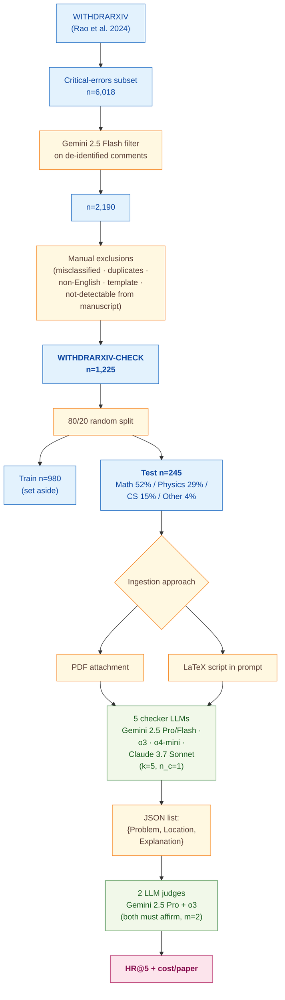

> [!success] **TL;DR**
> The paper makes a clean, well-instrumented case that today's reasoning LLMs — especially OpenAI's o3 and o4-mini — can flag the *specific* author-stated retraction error on roughly 60–70% of withdrawn math and physics papers, with o4-mini delivering nearly o3's accuracy at one-eighth the cost. The result that holds up cleanly is the cost–performance frontier within the OpenAI o-series.

## Structured abstract

> [!info] A plain-language summary built from this paper's discourse-graph nodes. Numbers and findings link back to specific EVD nodes — click any link to drill in.

### Question

Can today's top reasoning-style large language models (LLMs) — chatbots that "think step-by-step" before answering — actually catch the kinds of critical errors that get a scientific paper withdrawn? The authors test five proprietary reasoning LLMs as zero-shot manuscript quality checkers (no fine-tuning, just a single fixed prompt) on 245 real arXiv papers that authors withdrew because of factual or methodological errors. They also compare two ways of feeding the paper into the model: as a PDF attachment versus as the raw LaTeX source code. See [[QUE - Can reasoning LLMs identify critical errors and unsoundness problems in scientific papers?]].

### Methods

**Design.** The authors built a single cross-sectional benchmark in which five reasoning LLMs each reviewed the same 245 withdrawn arXiv papers under two ingestion conditions, with two separate LLMs serving as judges of whether the model's flagged problem matched the author's stated retraction reason.

**Tools.** The five "checker" models were Google's Gemini 2.5 Pro and Gemini 2.5 Flash (preview-04-17 and preview-05-06 — Google's flagship reasoning models, "Flash" is the cheaper sibling), OpenAI's o3 and o4-mini (snapshot 2025-04-16 — OpenAI's reasoning models, "mini" is the cheaper sibling), and Anthropic's Claude 3.7 Sonnet (snapshot 20250219, with extended thinking enabled). All ran via official APIs in Python. The two "judge" models were Gemini 2.5 Pro and o3 (Claude was disqualified as a judge after performing too poorly as a checker). The dataset is WITHDRARXIV-CHECK — a curated subset of WITHDRARXIV (Rao et al. 2024), itself a corpus of papers withdrawn from arXiv with author-supplied retraction comments.

**Procedure.** The authors first built WITHDRARXIV-CHECK by filtering 6,018 candidate withdrawn papers down to 1,225 cases with clearly-specified, manuscript-detectable errors. They split this 80/20 into a 980-paper training set (set aside, not used) and a 245-paper test set. For each test paper, each checker LLM was prompted once with a fixed simplistic instruction asking for up to five critical problems, returned as JSON entries with fields Problem, Location, and Explanation. Each paper was given to the model two ways: as a PDF attachment, and as the raw LaTeX source pasted into the prompt. For papers without LaTeX source (12% of the test set), the LaTeX-row results re-used the model's PDF-row prediction. Each problem the checker submitted was then independently scored by the two judge LLMs, who saw the gold retraction comment and answered yes-or-no whether the checker had found the same problem. A paper counted as a "hit" only if both judges said yes — a stricter rule designed to resist the well-known LLM-judge inflation problem. The headline metric is Hit Rate at 5 (HR@5): the share of the 245 test papers on which the model scored at least one confirmed hit. The authors also tracked cost per paper at early-May-2025 API pricing.

**Sample.** No human subjects. Papers flowed from 6,018 WITHDRARXIV critical-error candidates, through a Gemini 2.5 Flash filter (down to 2,190), then a five-rule manual exclusion pass (misclassified, duplicate-version, non-English, template-like, or not-detectable-from-manuscript), to a final WITHDRARXIV-CHECK corpus of 1,225 papers, randomly split into a 245-paper test set. Test composition skews heavily toward formal sciences: Math 52%, Physics 29%, Computer Science 15%, Other 4%. Median page count was 14 (range 2–136); 88% had LaTeX source available.

### Findings

- **OpenAI o3 was the best error catcher overall.** o3 hit on 64.9% of papers when fed PDFs and 71.0% when fed LaTeX (HR@5 — share of test papers on which the model raised at least one judge-confirmed real error, out of 245). Its single-judge HR@5 ran higher (72.7% to 80.4%), and the dual-judge fusion is what brings the headline number down — evidence that the strict "both judges must agree" rule is doing real work against inflation. o3 also used markedly fewer thinking tokens than the Gemini family (3,152 vs. 14,228 for Gemini 2.5 Pro under PDF), so "more thinking" did not translate into "more hits". [[EVD - OpenAI o3 achieved the highest hit rate of 64.9% (PDF) and 71.0% (LaTeX) among all reasoning LLMs tested as scientific paper quality checkers - @zhangReviewingScientificPapers2025a]]

- **o4-mini wins on dollars-per-hit by a wide margin.** o4-mini reached 59.6% HR@5 on PDFs and 61.6% on LaTeX — only 5.3 to 9.4 percentage points behind o3 — but at $0.038 and $0.043 per paper, roughly 8.4 to 8.9 times cheaper than o3 ($0.321 and $0.383 per paper). For anyone considering screening at scale, that cost ratio dominates the small accuracy gap. Both OpenAI models also gained from the LaTeX ingestion path, while the Gemini family slightly degraded under LaTeX — suggesting OpenAI's reasoning models received specialized LaTeX training. [[EVD - o4-mini achieved 59.6% HR@5 as a scientific paper quality checker at a cost of $0.038 per paper versus o3 at $0.321 per paper - @zhangReviewingScientificPapers2025a]]

- **Claude 3.7 Sonnet collapsed on PDF inputs.** When given PDFs, Claude returned an empty problem list on 64.9% of test papers and reached only 16.3% HR@5. Switching to LaTeX roughly doubled its hit rate to 33.1% and tripled the average problems submitted (1.6 to 3.4). Claude's PDF input-token usage was 9.3 times Gemini's and 2.6 times o3's — the authors trace this to Anthropic's PDF representation (per-page extracted text plus page image), suggesting the failure is a vendor-specific ingestion-pipeline problem, not a reasoning failure. The result was severe enough that the authors disqualified Claude from the judge pool. [[EVD - Claude 3.7 Sonnet found no problem in 64.9% of test papers and achieved only 16.3% hit rate as a PDF-based scientific quality checker - @zhangReviewingScientificPapers2025a]]

### Claim supported

These findings support the claim that [[CLM - Reasoning LLMs substantially outperform non-reasoning models at identifying critical scientific errors in papers and are viable as manuscript quality checkers]]. For someone considering deployment: o3 sets the current ceiling at roughly 7-in-10 papers caught when given LaTeX, o4-mini offers nearly the same accuracy at one-eighth the cost, and Claude's PDF pipeline is currently a non-starter for this use case. The authors frame the practical implication explicitly — these tools belong as a pre-screen feeding human reviewers, not as a replacement.

### Caveats

- **Only closed-source proprietary models were tested.** No open-source reasoning model (e.g., DeepSeek-R1, Qwen-QwQ, Llama-with-thinking variants) was evaluated, so we cannot tell whether o3's lead reflects reasoning-LLM capability in general or just one vendor's tooling. The Claude PDF collapse in particular looks more like a vendor pipeline issue than a model issue, and that hypothesis cannot be tested without open-source comparators. [[CVT - Only closed-source reasoning LLMs were evaluated as scientific paper quality checkers excluding open-source alternatives]]

- **The corpus is dominated by math and physics.** Math (52%) and physics (29%) papers together make up over 80% of the test set, and the kinds of "critical errors" in those fields tend to be formal — wrong equations, broken proofs, sign errors. Errors in empirical sciences (biology, medicine, social science) often hinge on study design, statistical analysis, or data quality, which look structurally different. The headline hit rates may not transfer. [[CVT - The error detection dataset was rich in math and physics papers and may not generalize to other scientific domains]]

### Methods at a glance

---

## Quality appraisal

> [!info] Risk-of-bias and validity assessment, synthesized from this paper's discourse-graph nodes and grounded in the same paper this page's top trust-signal chips summarize. Covers *methodological quality* — the TRIPOD-LLM table below covers *reporting compliance* instead.
> <dl class="callout-legend">
> <dt>● Low risk</dt><dd>No meaningful threat to this domain identified</dd>
> <dt>◐ Some risk</dt><dd>A real but non-fatal limitation</dd>
> <dt>○ High risk</dt><dd>A significant, unaddressed threat to validity</dd>
> </dl>

| Domain | Rating | Quote |
| --- | :---: | --- |
| **Construct validity**: does the metric actually measure the construct? | 🟡 | *"Please note that there is no gold standard for precision evaluation in our experiment, and that a case in which an LLM checker found no problem is skipped because a precision value cannot be calculated."* `§2.3, p.4` |
| **Internal validity**: could the comparison be biased? | 🟡 | *"We initially planned for m = 3 with Claude 3.7 Sonnet as the last judge, but its overly low hit rate under the PDF-based approach indicates that it might not qualify for serving as a judge in this task."* `§2.4, p.4` |
| **External validity**: do findings generalize? | 🔴 | *"our results based on a dataset rich in math and physics papers published in the past may not generalize well to papers in other scientific domains or future papers."* `§5 Limitation, p.7` |
| **Statistical Conclusion Validity**: appropriate uncertainty + comparisons? | 🟡 | *"our settings that each LLM checker was tested only once per paper and each LLM judge graded each submission only once. Nevertheless, a higher score under parallel evaluation still reasonably indicates better performance of an LLM checker."* `§5 Limitation, p.7` |
| **Reproducibility**: code, data, determinism? | 🟡 | *"Our WITHDRARXIV-CHECK dataset, experiment code, and model outputs (including thinking outputs if available) are available on Github."* `Data Availability, p.8` |
| **Data leakage**: could models have seen this data pretraining? | 🔴 | *"One potential concern over the validity of our evaluation results is that LLMs might have seen the test papers (or other versions of them) in their training data. ... Nevertheless, it would be beneficial to evaluate LLMs on papers that are unlikely to be included in the training phase, such as those published after the knowledge cutoff dates of LLMs."* `§4 Discussion, p.6–7` |
| **Baseline adequacy**: is there a meaningful floor to beat? | 🔴 | Not reported, no trivial or naive comparator (e.g., a keyword-matching or random-guess checker) is evaluated alongside the five reasoning LLMs |
| **Train/dev/test hygiene**: are data splits kept separate? | 🟡 | *"We randomly sampled 20% of the dataset (245 cases) as the test set for evaluation experiments. The remaining 80% (980 cases) of the dataset was set aside for training and validation, although these latter two steps were not considered in this work whose main objective was to establish baseline approaches and evaluation methods."* `§2.1, p.2` |
| **Multiple-comparisons correction**: controlled for repeated testing? | 🔴 | Not reported, no correction is stated across the 5 checkers × 2 ingestion approaches × 2 judge configurations in Tables 2–3 |
| **Human-baseline comparability**: is there a human reference point? | 🔴 | Not addressed, no live human-expert reviewer was run alongside the LLM checkers; gold labels are the authors' own retraction comments |
| **Confidence Intervals**: are point estimates accompanied by an interval? | 🔴 | Not reported — hit-rate figures (HR@5, e.g. 64.9%, 16.3%) are given as point estimates with no interval |
| **Chance-Corrected Metrics**: does agreement/accuracy correct for chance? | 🔴 | Not reported — only hit rate / mean hit rate at k are reported `Table 2-3`; no chance-corrected statistic appears anywhere |
| **Non-Significant Result Spin**: are null or negative findings framed plainly? | 🟢 | *"Claude 3.7 Sonnet found no problem in 64.9% of test papers, leading to a low hit rate of 16.3%."* `p.3`, and the authors explicitly disqualified Claude from the judge pool as a result — no attempt to soften or omit this negative result |
| **Statistic Accuracy**: do the paper's own reported numbers check out? | 🟢 | Reported hit-rate figures decrease monotonically as expected between the single-judge and stricter dual-judge-fusion conditions (e.g. o3's single-judge HR@5 of 72.7–80.4% falling to a lower dual-judge headline of 64.9–71.0%), with no internal inconsistency `p.3` |
| **Ablation Experiment(s)**: does the paper isolate a component's contribution? | 🟢 | *"we evaluated the PDF-based approach and the LaTeX-based approach in this work"*, with Table 2 reporting hit rates for both input-format conditions per model — *"After switching to LaTeX, hit rates of Gemini models slightly decreased... In contrast, the hit rates of o-series models increased."* `pp.2-3` |
| **AI Writing Check**: does the paper's own prose read as AI-generated? | 🟢 | Independent recheck run because this source's Data Repo Check and Code Check both returned "No repository claimed". Pangram v3.3.2 AI-text detector: *"We believe that this document is fully human-written"* (0% AI-generated, 0% AI-assisted). [Dashboard](https://www.pangram.com/history/153df094-7481-4582-901a-075c6a6714f7) |

**Bottom line.** The paper makes a clean, well-instrumented case that today's reasoning LLMs — especially OpenAI's o3 and o4-mini — can flag the *specific* author-stated retraction error on roughly 60–70% of withdrawn math and physics papers, with o4-mini delivering nearly o3's accuracy at one-eighth the cost. The result that holds up cleanly is the cost–performance frontier within the OpenAI o-series. The result that does *not* hold up cleanly is "reasoning LLMs are viable manuscript quality checkers" in general: the test bed is overwhelmingly formal-sciences, the false-positive rate is unmeasured, no open-source models are tested, and the Claude PDF result is more a story about Anthropic's PDF pipeline than about reasoning capability. Before deployment in a real journal-screening workflow, future work needs precision/recall on a domain-balanced corpus, open-source comparators, and a head-to-head against expert human reviewers on the same papers.

> [!tip] **Applicable external appraisal frameworks beyond TRIPOD-LLM** (already covered by the table below): **HELM** (Liang et al. 2022) for holistic LLM-evaluation principles · **Datasheets for Datasets** (Gebru et al. 2021) for the evaluation corpus · **Model Cards** (Mitchell et al. 2019) for the LLMs being evaluated

---

## TRIPOD-LLM reporting summary

> [!info] Reporting compliance for this paper, mapped to the TRIPOD-LLM checklist (Title/Abstract/Introduction items 1–4, Methods items 5a–15, Results items 16a–18). TRIPOD-LLM is a clinical-ML guideline being applied here to a non-clinical AI-research benchmark — where an item's own wording says "healthcare context" or "care pathway," it's read as "research-evaluation context" / "research workflow" instead. Item 17 (Performance) is reported per-EVD; see each EVD's `## Other Notes`.
> 

> ●Fully reported
> ◐Partial / unclear
> ○Not reported
> –Not applicable
> 

| # | Item | ✓ | Quote |
| --- | --- | :---: | --- |
| **1** | Title | ✅ | *"Reviewing Scientific Papers for Critical Problems With Reasoning LLMs: Baseline Approaches and Automatic Evaluation"* `Title, p.1` |
| **2** | Abstract | ➖ | Assessed separately under TRIPOD-LLM's own Abstract extension, not scored here |
| **3a** | Background — context + rationale | ✅ | *"Recent advancements in the domain intelligence of large language models (LLMs) have fostered interest in utilizing them to aid the peer review process of scientific publication, especially in consideration of the peer review crisis due to the skyrocketing number of paper submissions in recent years"* `§1, p.1` |
| **3b** | Background — target population | ⚠️ | *"In this work, we consider the identification of critical errors and unsoundness problems that may invalidate the conclusions of a paper, a key sub-task in peer review, as the main goal of an LLM manuscript checker."* `§1, p.2` |
| **4** | Objectives | ✅ | *"we propose adopting LLMs as manuscript quality checkers. We introduce several baseline approaches and an extendable automatic evaluation framework using top reasoning LLMs as judges to tackle the difficulty of recruiting domain experts for manual evaluation."* `Abstract, p.1` |
| **5a** | Data sources | ✅ | *"We utilized WITHDRARXIV [Rao et al., 2024], a large-scale dataset of papers withdrawn from arXiv by September 2024, along with associated retraction comments from authors and well-defined retraction categories."* `§2.1, p.2` |
| **5b** | Data points + distribution | ✅ | *"Sample size — Train 980 / Test 245 · Main subject: Math 492 (50%)/128 (52%), Physics 256 (26%)/70 (29%), Computer Science 196 (20%)/37 (15%), Others 36 (4%)/10 (4%)"* `Table 1, p.3` |
| **5c** | Date range of data | ⚠️ | *"a large-scale dataset of papers withdrawn from arXiv by September 2024"* `§2.1, p.2` — exact earliest withdrawal date and dataset-construction date not stated, only decade-scale buckets in Table 1 |
| **5d** | Pre-processing / quality checks | ✅ | *"de-identified retraction comments were first provided to Gemini 2.5 Flash (preview-04-17) to determine whether each retraction comment clearly specified the error... We also corrected mistakenly redacted theorem names in the retraction comments."* `§2.1, p.2` |
| **5e** | Missing / imbalanced data | ⚠️ | *"For the small proportion of papers without available LaTeX scripts (Table 1), we resorted to utilizing the problems identified by the same model through the PDF-based approach."* `§2.2, p.3` |
| **6a** | LLM name + version | ✅ | *"The following reasoning LLMs were tested as paper quality checkers: Google's Gemini 2.5 Pro (preview-05-06) and Gemini 2.5 Flash (preview-04-17); OpenAI's o3 (2025-04-16) and o4-mini (2025-04-16); Anthropic's Claude 3.7 Sonnet (20250219)."* `§2.4, p.4` |
| **6b** | Development process | ➖ | Not applicable — no model development, fine-tuning, or training performed; off-the-shelf API models used as-is |
| **6c** | Inference settings / prompting | ✅ | *"Gemini 2.5 Pro and Gemini 2.5 Flash: thinking budget: default (automatic) ... tools: [] temperature: 0 seed: 42 ... o3 and o4-mini: reasoning effort: defaults to \"medium\" ... temperature and seed: not supported ... Claude 3.7 Sonnet: max tokens: 16,000 ... temperature: 1 (required for thinking) seed: not supported"* `Appendix B, p.11` |
| **6d** | Output | ✅ | *"give me up to {k} most critical problems as a JSON object using the following schema: Entry = {\"Problem\": str, \"Location\": str, \"Explanation\": str}, Return: list[Entry]."* `Appendix A, p.10` |
| **6e** | Classification thresholds | ➖ | Not applicable — outputs are free-text JSON entries with no probability thresholding; hit / true-positive decisions are majority-vote judge labels |
| **7a** | Quality metrics | ✅ | *"LLM checkers were primarily evaluated by their hit rates on test papers... we report this metric as the Hit Rate at k (HR@k)."* `§2.3, p.3` |
| **7b** | Relevance to downstream use | ✅ | *"journal publishers and conference organizers may consider incorporating LLM quality checkers into initial assessments of manuscripts [Bauchner and Rivara, 2024], thereby reducing the burden on reviewers."* `§4, p.7` |
| **7c** | Outcome definition | ✅ | *"If an LLM checker receives a majority of (or all, for a stricter evaluation) affirmative votes from LLM judges, it is deemed to have made a hit on a paper."* `§2.3, p.3` |
| **7d** | Subjective interpretation | ⚠️ | *"Considering the daunting cost of recruiting domain experts to manually evaluate LLM-identified scientific errors, we propose an automatic evaluation pipeline to streamline the process."* `§2.3, p.3` — LLM judges substitute for human expert interpretation; no human spot-check of judge accuracy reported |
| **7e** | Comparison | ✅ | *"A concurrent work on arXiv by Son et al. [2025] also utilizes the WITHDRARXIV dataset for automatic error detection in scientific papers... The two efforts are complementary, and both report the leading performance of o3."* `§4, p.7` |
| **8a** | Annotation guidelines | ➖ | Not applicable — no human annotation in this study; gold labels are author-supplied retraction comments, and the LLM-judge prompt (Appendix A) defines the matching criterion |
| **8b** | Annotators + IAA | ⚠️ | Not applicable — no human annotators; inter-judge agreement between Gemini 2.5 Pro and o3 not reported as a κ / agreement statistic |
| **8c** | Annotator background | ➖ | Not applicable |
| **9a** | Prompt design | ✅ | *"In our experiments, both approaches utilized the same simplistic, general task instruction (Appendix A)... The prompt was not customized for our dataset that is rich in math and physics papers."* `§2.2, p.3` |
| **9b** | Prompt-development data | ❌ | Not reported |
| **10** | Summarization | ➖ | Not applicable — no summarization endpoint evaluated |
| **11** | Instruction tuning / alignment | ➖ | Not applicable — no model training, fine-tuning, or alignment performed |
| **12** | Compute | ⚠️ | *"we recorded token usage to inform future work that seeks to apply LLMs at a larger scale. Average costs of reviewing a paper under each pipeline-LLM combination were estimated based on the standard API pricing of the LLM vendors in June 2025."* `§3, p.4` — no GPU / wall-clock compute reported |
| **13** | Ethical approval | ➖ | *"In this work, we circumvent this challenge by utilizing publicly available arXiv papers."* `§4, p.7` — no IRB/ethics-committee statement present (not human-subjects research) |
| **14a** | Funding | ✅ | *"This work is supported by the Ira Kalet and Fred Wolf Endowment Fund from the Department of Biomedical Informatics and Medical Education, University of Washington."* `Acknowledgments and Disclosure of Funding, p.8` |
| **14b** | Conflicts of interest | ✅ | *"The authors declare no competing interest."* `Acknowledgments and Disclosure of Funding, p.8` |
| **14c** | Protocol | ❌ | Not reported |
| **14d** | Registration | ➖ | Not applicable — not a registered clinical study |
| **14e** | Data availability | ✅ | *"Our WITHDRARXIV-CHECK dataset, experiment code, and model outputs (including thinking outputs if available) are available on Github."* `Data Availability, p.8` |
| **14f** | Code availability | ✅ | *"experiment code, and model outputs (including thinking outputs if available) are available on Github."* `Data Availability, p.8` |
| **15** | Patient/public involvement | ➖ | Not applicable |
| **16a** | Flow of data | ✅ | *"This step resulted in a subset of 2,190 cases. Our manual review further excluded cases that (1) were incorrectly identified during LLM screening... The final dataset, named WITHDRARXIV-CHECK, contains 1,225 cases in total."* `§2.1, p.2` |
| **16b** | Characteristics | ✅ | *"Dataset characteristics are provided in Table 1."* `Table 1, p.3` |
| **16c** | Distribution comparison | ⚠️ | *"2007-2012 155 (16%) 32 (13%) · 2013-2018 487 (50%) 114 (47%) · 2019-2024 338 (34%) 99 (40%)"* `Table 1, p.3` — train/test time-span distributions shown side by side but no formal balance test reported |
| **16d** | N per analysis | ✅ | *"we took k = 5, nc = nj = 1, and m = 2, i.e., each LLM checker was tested once with each paper and was allowed to report up to 5 problems, and 2 LLMs served as judges"* `§2.4, p.4` |
| **17** | Performance | `per-EVD` | Reported per-EVD. See each EVD's `## Other Notes`. |
| **18** | LLM updating | ➖ | Not applicable — no model updating reported |
