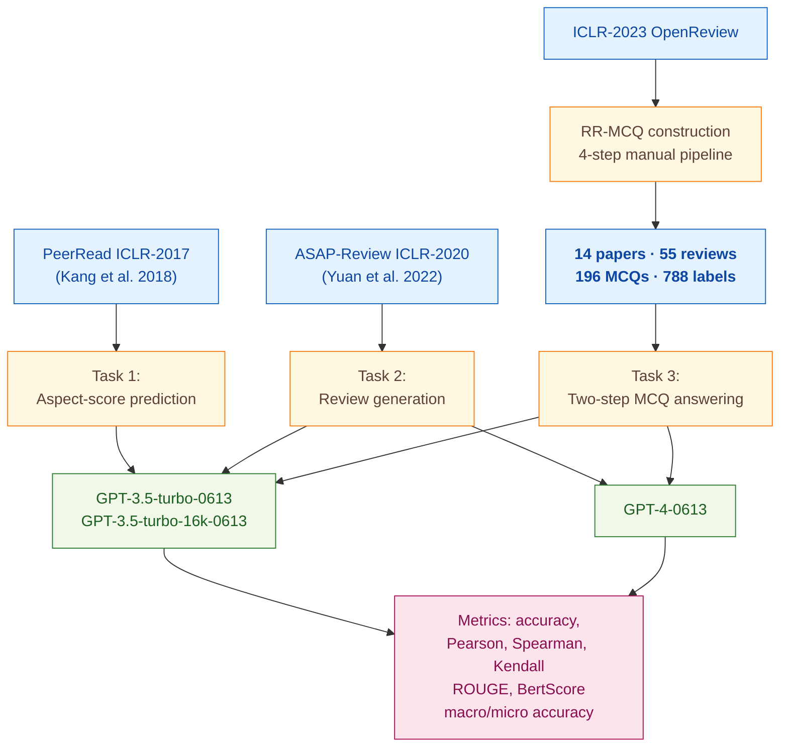

> [!success] **TL;DR**
> The paper makes a defensible negative claim: an off-the-shelf GPT-4, prompted in plausible ways, hits roughly 28% on the reasoning-heavy reviewer questions that the authors built RR-MCQ to capture.

## Structured abstract

> [!info] A plain-language summary built from this paper's discourse-graph nodes. Numbers and findings link back to specific EVD nodes — click any link to drill in.

### Question

Can a general-purpose large language model (LLM) act as a trustworthy peer reviewer for machine-learning research papers? The authors test two off-the-shelf models — GPT-3.5 and GPT-4 — across three concrete reviewer-style tasks: predicting numerical aspect scores, writing free-form reviews, and answering multiple-choice questions about real reviewer-author discussions. They keep the models completely off-the-shelf (no fine-tuning) and compare different ways of prompting them. See [[QUE - Is LLM a reliable reviewer for automatic paper reviewing tasks?]].

### Methods

**Design.** The authors run a zero-shot and few-shot prompting study on two existing peer-review benchmarks plus one new benchmark they built themselves, with the LLM as the system under test rather than as the rater.

**Tools.** The models are OpenAI's **GPT-3.5-turbo-0613**, **GPT-3.5-turbo-16k-0613** (a longer-context version for whole-paper inputs), and **GPT-4-0613**. The benchmarks are **PeerRead** (a published ICLR-2017 review corpus from Kang et al., 2018) for aspect-score prediction, **ASAP-Review** (Yuan et al., 2022) for review generation, and the authors' new **RR-MCQ** dataset, released on Hugging Face, which converts real review-rebuttal forum exchanges into multiple-choice questions. Evaluation metrics include accuracy, Pearson and Spearman correlation (which measure how well two ranked lists agree, from -1 to 1, with 1 meaning perfect agreement), ROUGE and BertScore for text similarity, plus macro and micro accuracy for the MCQ task.

**Procedure.** For task 1 (aspect-score prediction), the authors prompt the model as "a professional reviewer in computer science and machine learning" and ask it to score 8 review aspects on a 1–5 scale. They run two settings: given the human-written review, or given parts of the paper. For task 2 (review generation), the model writes a review of an ASAP paper and the authors compare its output to gold human reviews using both automatic metrics and manual scoring. For task 3 (RR-MCQ), the authors first build the benchmark by selecting 55 reviews from 14 ICLR-2023 papers, distilling them into 196 multiple-choice questions, and labeling each question across 4 dimensions. Two graduate students annotate the labels. Then a two-step pipeline runs: step 1 picks relevant sections from the paper, step 2 answers the MCQ. All inference uses temperature 0.3 (a setting that controls randomness — lower means more deterministic).

**Sample.** The PeerRead subset covers 427 official ICLR-2017 reviews carrying 1,300 aspect scores. The ASAP evaluation uses 300 papers for GPT-3.5 and a smaller 50-paper slice for GPT-4 (the authors note "the generation is expensive" as the reason for the cap). The RR-MCQ benchmark contains 196 questions from 14 ICLR-2023 papers, with 788 aspect labels assigned by two graduate-student annotators who initially disagreed on 10.9% of labels and resolved the rest by discussion.

### Findings

- **GPT-3.5 mimics human reviewers when handed the review itself.** Given a human-written review and 5 demonstration examples (few-shot prompting, where the model sees worked examples before answering), GPT-3.5 predicted aspect scores at a Pearson correlation of 0.651 — roughly twice the correlation of a "most-frequent score" baseline (0.333). When the same model was given only the paper instead of the review, correlation collapsed to 0.131–0.258. The model can read a review and infer the score, but it cannot judge the paper itself. [[EVD - GPT-3.5 achieved Pearson r=0.651 in predicting review aspect scores when given the human-written review - @zhouLLMReliableReviewer2024]]

- **GPT-4 fails the deeper reviewer test on RR-MCQ.** On the 196 multiple-choice questions distilled from real review-rebuttal threads, the best pipeline (GPT-4 selecting sections, then GPT-4 answering) reached only 0.276 macro accuracy — meaning roughly 28% of questions were answered completely correctly. Micro accuracy (treating each of 4 options as a separate True/False decision) was higher at 0.710, but micro accuracy is inflated by easy "wrong-option rejections". GPT-4 did worst on questions about argumentation soundness (macro accuracy 0.193) and constructive suggestions (0.153) — exactly the reasoning-heavy questions that matter most for real review work. [[EVD - GPT-4 RR-MCQ macro accuracy was 0.276 and micro accuracy 0.710 on 196 review-revision multiple choice questions - @zhouLLMReliableReviewer2024]]

### Claim supported

These findings together support the claim that [[CLM - Current LLMs are not yet qualified as reliable automatic reviewers for scientific papers]], and a related observation that [[CLM - General-purpose LLMs produce overly positive peer review recommendations that do not reflect human reviewer distributions]]. For anyone considering wiring GPT-4 into a reviewing workflow, the practical message is blunt: the model can pattern-match a review back to a numeric score, but on the harder reasoning questions a real reviewer actually answers, it sits at 28% — far below what a journal or conference could deploy without a human in the loop.

### Caveats

- **The new RR-MCQ benchmark is small and narrow.** Only 14 ICLR-2023 papers and 196 questions — drawn from a single venue and discipline. The authors themselves note the "high cost of designing high-quality questions". A larger, multi-venue benchmark could shift the headline numbers. [[CVT - The Zhou RR-MCQ dataset was constructed from only 14 ICLR papers limiting diversity and scale]]

### Methods at a glance

---

## Critical appraisal

> [!info] A risk-of-bias and validity assessment across five domains, synthesized from this paper's discourse-graph nodes. Each domain gets a rating (🟢 Low risk · 🟡 Some concerns · 🔴 High risk) plus a brief, EVD-grounded justification. The TRIPOD-LLM table below covers *reporting compliance*; this section covers *methodological quality*.

| Domain | Rating | Justification |
| --- | :---: | --- |
| **Construct validity** — does the metric actually measure the construct? | 🟡 | The aspect-score correlation construct is well-defined when the model is given the review, but the headline 0.651 Pearson rewards a model that can re-derive a score from review text — not one that can review a paper. On RR-MCQ, macro accuracy directly maps to the deployment-relevant construct ("could this model take a real reviewer's place?") and the answer is 0.276; the much rosier micro accuracy (0.710) is dominated by easy wrong-option rejections and should not be used as the headline. |
| **Internal validity** — could the comparison be biased? | 🟡 | RR-MCQ option order is shuffled and inference is paired across pipeline configurations, which is good practice. Two concerns. (1) The closed-source GPT models could have seen ICLR-2017 / ICLR-2023 OpenReview pages during pretraining — the authors do not test for contamination. (2) No prior LLM-reviewer baseline (e.g., ReviewerGPT, Liang et al.) is re-implemented, so the "GPT-4 is the strongest" framing rests on within-paper comparisons only. |
| **External validity** — do findings generalize? | 🔴 | Three constraints stack. (1) RR-MCQ covers only 14 ICLR-2023 papers and 196 questions from one ML conference — see [[CVT - The Zhou RR-MCQ dataset was constructed from only 14 ICLR papers limiting diversity and scale]]. (2) PeerRead and ASAP are also ICLR/NeurIPS-flavoured ML venues, so all three benchmarks share the same disciplinary slice. (3) Findings are model-snapshot specific (GPT-3.5/4-0613); the OpenAI API has since deprecated these versions, so the literal numbers cannot be reproduced today. |
| **Statistical rigor** — appropriate uncertainty + comparisons? | 🟡 | Pearson, Spearman, and Kendall reported with p-value cells in Table 2 — appropriate for the correlation task. But there are no confidence intervals on F1 / accuracy, no multiple-comparison correction across 8 aspects × 3 pipeline configurations, and no significance test on the GPT-4 vs. GPT-3.5 RR-MCQ gap. With only 196 MCQs and 14 papers underlying them, per-aspect macro accuracies (e.g., 0.153 on "Add") are estimated from single-digit question counts. |
| **Reproducibility** — code, data, determinism? | 🟡 | RR-MCQ is publicly released on Hugging Face (TRIPOD-LLM 14e ⚠️) and prompts are provided verbatim in Appendix A. But no code repository is linked (14f ❌), generated GPT reviews are not released, and inference parameters beyond temperature (top_p, seed, system prompt edge-cases) are not reported (6c ⚠️). The deprecated GPT-3.5/4-0613 snapshots compound this — exact replication is now impossible without a model-version proxy. |

**Bottom line.** The paper makes a defensible negative claim: an off-the-shelf GPT-4, prompted in plausible ways, hits roughly 28% on the reasoning-heavy reviewer questions that the authors built RR-MCQ to capture. That number is hard to spin into a deployment story. The headline weakness is sample scope — only 14 ICLR papers and one model family — so before treating this as a closed verdict, the field needs the same experiment scaled across more venues, more disciplines, and current model snapshots (GPT-4o, Claude 3.5+, open-weights long-context models).

> [!tip] **Applicable external appraisal frameworks beyond TRIPOD-LLM** (already covered by the table below): **HELM** (Liang et al. 2022) for holistic LLM-evaluation principles · **Datasheets for Datasets** (Gebru et al. 2021) for the evaluation corpus · **Model Cards** (Mitchell et al. 2019) for the LLMs being evaluated

---

## TRIPOD-LLM reporting summary

> [!info] Reporting compliance for this paper, mapped to the TRIPOD-LLM checklist (Methods items 5a–15 and Results items 16a–18). Compliance icons: ✅ fully reported · ⚠️ partially reported / unclear · ❌ should be reported but not reported · ➖ not applicable to this study. Item 17 (Performance) is reported per-EVD; see each EVD's `## Other Notes`.

| # | Item | ✓ | Reported in this study |
| --- | --- | :---: | --- |
| **5a** | Data sources | ✅ | Three datasets: PeerRead ICLR-2017 subset (Kang et al., 2018) for aspect-score prediction; ASAP ICLR-2020 subset (Yuan et al., 2022) for review generation; authors' own RR-MCQ built from 14 ICLR-2023 papers and review-rebuttal forum posts. |
| **5b** | Data points + distribution | ✅ | PeerRead: 427 reviews / 1.3k aspect scores on 1–5 scale × 8 aspects. ASAP: 300 papers + 902 reviews used for GPT-3.5; 50 papers used for GPT-4. RR-MCQ: 196 MCQs from 55 reviews of 14 papers; 788 aspect labels (4 categories). Aspect-distribution histograms in Figures 3 and 5. |
| **5c** | Date range of data | ⚠️ | Source-conference vintages reported (ICLR-2017, ICLR-2020, ICLR-2023). OpenAI training cutoffs not disclosed; inference dates not reported. |
| **5d** | Pre-processing / quality checks | ⚠️ | RR-MCQ construction described as 4-step manual process (alignment, topic ID, MCQ transform, labelling). Aspect "not discussed" cases excluded for that aspect in PeerRead. ASAP section-extraction step described, but exact text-cleaning (e.g., math/figure handling) not detailed. |
| **5e** | Missing / imbalanced data | ⚠️ | Aspect-label imbalance acknowledged via Figures 3 and 5. PeerRead "not discussed" labels handled by aspect-level skip. RR-MCQ option counts undetermined per question (1–4 correct). No algorithmic rebalancing. |
| **6a** | LLM name + version | ✅ | GPT-3.5-turbo-0613, GPT-3.5-turbo-16k-0613, GPT-4-0613 (OpenAI). "If not specially marked, all models are of version 0613." |
| **6b** | Development process | ✅ | No fine-tuning; all evaluation uses pretrained OpenAI models with prompting only. |
| **6c** | Inference settings / prompting | ⚠️ | Temperature reported (0.3, "If not specially marked, all models are of version 0613 with temperature 0.3"). System prompts in full in Appendix A. Other parameters (top_p, max tokens, seed, frequency/presence penalty) not reported. |
| **6d** | Output | ✅ | Task 1: aspect score 1–5 per aspect. Task 2: review text with bracketed aspect-sentiment labels (e.g., [SUBSTANCE_POSITIVE]). Task 3: A/B/C/D selection (one or more options). |
| **6e** | Classification thresholds | ➖ | Discrete classification outputs; no probability thresholds applied. |
| **7a** | Quality metrics | ✅ | Task 1: accuracy, \|diff\|, Pearson, Spearman, Kendall's tau. Task 2: aspect coverage/recall, ROUGE-1/2/L, BertScore, BLANC, GPT-4-as-judge relevance/precision/recall, manual relevance/informativeness, plus Pearson correlation between auto metrics and human judgements (Table 6). Task 3: macro/micro accuracy, precision, recall, F1 (overall and per-aspect). |
| **7b** | Relevance to downstream | ⚠️ | Authors discuss qualitative downstream implications ("LLM cannot naturally generate comments of people's interest", "still too early to trust LLM as automatic scientific paper reviewer"), but no formal cost/utility analysis or human-reviewer-time comparison. |
| **7c** | Outcome definition | ✅ | Aspect score = integer 1–5; "good review" implicitly defined by similarity to gold human reviews; MCQ correctness = exact-match (macro) or per-option binary (micro). |
| **7d** | Subjective interpretation | ⚠️ | Manual scoring of 50 GPT-4 reviews by authors on relevance and informativeness (0–100 scale); rubric and number of raters not detailed. RR-MCQ aspect labels by 2 graduate students with disagreement rate reported (10.9%) but no formal κ. |
| **7e** | Comparison | ✅ | Most-frequent-score baseline for Task 1; GPT-3.5 vs. GPT-4 across pipeline configurations for Task 3; reference reviews + multiple automatic metrics + manual scoring for Task 2. No prior-LLM-reviewer baselines (e.g., Liu & Shah 2023, Liang et al. 2023) re-implemented. |
| **8a** | Annotation guidelines | ✅ | RR-MCQ labelling principle in Appendix B: 4 dimensions (review aspect, content aspect, ability, extra-info) with sub-categories defined. |
| **8b** | Annotators + IAA | ⚠️ | RR-MCQ: "two experienced students in the domain"; 86/788 (10.9%) initial disagreement, resolved by consensus discussion; no κ reported. Manual ASAP scoring done by authors; agreement not reported. |
| **8c** | Annotator background | ⚠️ | "Two experienced students in the domain" for RR-MCQ; specific field, degree level, and reviewing experience not detailed. |
| **9a** | Prompt design | ✅ | Full prompts for all three tasks (PeerRead Settings 1–2 with zero-shot/few-shot/MCQ-style; ASAP Settings 1–2; RR-MCQ Settings 1–2) provided verbatim in Appendix A. |
| **9b** | Prompt-development data | ⚠️ | Justifies "most-frequent score" few-shot demonstrations against "all-1" / "all-5" alternatives on 100 PeerRead examples (Table 3). No held-out prompt-development set described for RR-MCQ. |
| **10** | Summarization | ➖ | Not a summarization study (review generation is closer to abstractive critique than summarization; authors treat it as such only for BLANC scoring). |
| **11** | Instruction tuning / alignment | ➖ | No fine-tuning or alignment performed in this paper. |
| **12** | Compute | ❌ | Not reported. Authors note "the generation is expensive and that the manual analysis also has a high cost" as the reason GPT-4 ASAP evaluation was capped at 50 papers, but no GPU/API-cost figures. |
| **13** | Ethical approval | ➖ | Not applicable (analysis of public peer-review data; no human-subjects experiment). |
| **14a** | Funding | ✅ | National Key R&D Program of China 2023ZD0120703; China NSFC U23B2057, 62106142, 62120106006; Shanghai Municipal Science and Technology Major Project 2021SHZDZX0102. |
| **14b** | Conflicts of interest | ❌ | No COI statement located. |
| **14c** | Protocol | ❌ | Not reported. |
| **14d** | Registration | ➖ | Not a clinical study. |
| **14e** | Data availability | ⚠️ | RR-MCQ released at huggingface.co/datasets/zhouruiyang/RR-MCQ. PeerRead and ASAP are pre-existing public datasets cited via prior work. Generated GPT-3.5/GPT-4 reviews not released. |
| **14f** | Code availability | ❌ | No code repository linked. |
| **15** | Patient/public involvement | ➖ | Not applicable (NLP benchmarking of peer review). |
| **16a** | Flow of data | ⚠️ | RR-MCQ flow described prose-only (ICLR-2023 → 14 papers → 55 reviews → 196 MCQs); no consort-style diagram. PeerRead/ASAP subset selection inherits from cited dataset papers. |
| **16b** | Characteristics | ⚠️ | Aspect distribution histograms (Figures 3, 5) and label-distribution counts shown. Paper-domain (computer-science/ML conferences only) implicit; no per-paper statistics (length, citation count, decision outcome). |
| **16c** | Distribution comparison | ➖ | Not applicable (no clinical-subgroup analysis). |
| **16d** | N per analysis | ✅ | PeerRead 427 reviews / 1.3k scores; PeerRead "given abstract" sub-experiment 100 examples; ASAP 300 examples (GPT-3.5) and 50 examples (GPT-4); RR-MCQ 196 MCQs across 3 pipeline configurations. |
| **17** | Performance | (per-EVD) | Reported per-EVD. See each EVD's `## Other Notes`. |
| **18** | LLM updating | ➖ | Not applicable (no model updating reported). |
