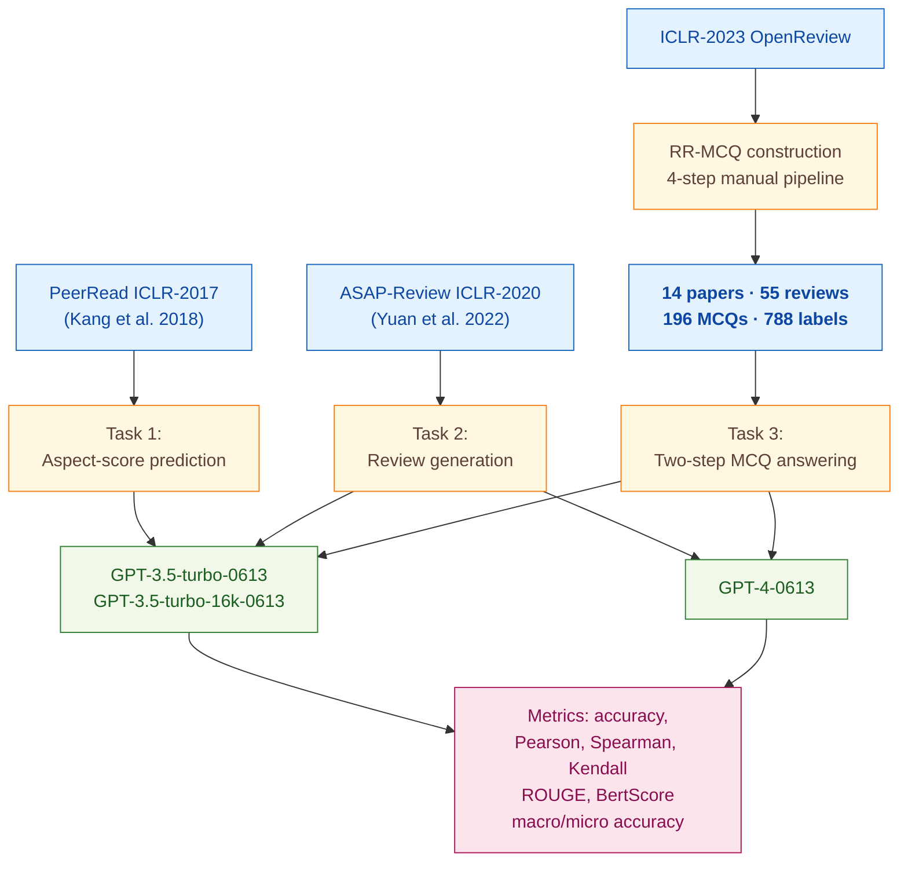

> [!success] **TL;DR**
> The paper makes a defensible negative claim: an off-the-shelf GPT-4, prompted in plausible ways, hits roughly 28% on the reasoning-heavy reviewer questions that the authors built RR-MCQ to capture.

## Abstract

### Question

Can a general-purpose large language model (LLM) act as a trustworthy peer reviewer for machine-learning research papers? The authors test two off-the-shelf models, GPT-3.5 and GPT-4, across three concrete reviewer-style tasks: predicting numerical aspect scores, writing free-form reviews, and answering multiple-choice questions about real reviewer-author discussions. They keep the models completely off-the-shelf (no fine-tuning) and compare different ways of prompting them. See [[QUE - Is LLM a reliable reviewer for automatic paper reviewing tasks?]].

### Methods

**Design.** The authors run a zero-shot and few-shot prompting study on two existing peer-review benchmarks plus one new benchmark they built themselves, with the LLM as the system under test rather than as the rater.

**Tools.** The models are OpenAI's GPT-3.5-turbo-0613, GPT-3.5-turbo-16k-0613 (a longer-context version for whole-paper inputs), and GPT-4-0613. The benchmarks are PeerRead (a published ICLR-2017 review corpus from Kang et al., 2018) for aspect-score prediction, ASAP-Review (Yuan et al., 2022) for review generation, and the authors' new RR-MCQ dataset, released on Hugging Face, which converts real review-rebuttal forum exchanges into multiple-choice questions. Evaluation metrics include accuracy, Pearson and Spearman correlation (which measure how well two ranked lists agree, from -1 to 1, with 1 meaning perfect agreement), ROUGE and BertScore for text similarity, plus macro and micro accuracy for the MCQ task.

**Procedure.** For task 1 (aspect-score prediction), the authors prompt the model as "a professional reviewer in computer science and machine learning" and ask it to score 8 review aspects on a 1–5 scale. They run two settings: given the human-written review, or given parts of the paper. For task 2 (review generation), the model writes a review of an ASAP paper and the authors compare its output to gold human reviews using both automatic metrics and manual scoring. For task 3 (RR-MCQ), the authors first build the benchmark by selecting 55 reviews from 14 ICLR-2023 papers, distilling them into 196 multiple-choice questions, and labeling each question across 4 dimensions. Two graduate students annotate the labels. Then a two-step pipeline runs: step 1 picks relevant sections from the paper, step 2 answers the MCQ. All inference uses temperature 0.3 (a setting that controls randomness, lower means more deterministic).

**Sample.** The PeerRead subset covers 427 official ICLR-2017 reviews carrying 1,300 aspect scores. The ASAP evaluation uses 300 papers for GPT-3.5 and a smaller 50-paper slice for GPT-4 (the authors note "the generation is expensive" as the reason for the cap). The RR-MCQ benchmark contains 196 questions from 14 ICLR-2023 papers, with 788 aspect labels assigned by two graduate-student annotators who initially disagreed on 10.9% of labels and resolved the rest by discussion.

### Findings

- **GPT-3.5 mimics human reviewers when handed the review itself.** Given a human-written review and 5 demonstration examples (few-shot prompting, where the model sees worked examples before answering), GPT-3.5 predicted aspect scores at a Pearson correlation of 0.651, roughly twice the correlation of a "most-frequent score" baseline (0.333). When the same model was given only the paper instead of the review, correlation collapsed to 0.131–0.258. The model can read a review and infer the score, but it cannot judge the paper itself. [[EVD - GPT-3.5 achieved Pearson r=0.651 in predicting review aspect scores when given the human-written review - @zhouLLMReliableReviewer2024]]

- **GPT-4 fails the deeper reviewer test on RR-MCQ.** On the 196 multiple-choice questions distilled from real review-rebuttal threads, the best pipeline (GPT-4 selecting sections, then GPT-4 answering) reached only 0.276 macro accuracy, meaning roughly 28% of questions were answered completely correctly. Micro accuracy (treating each of 4 options as a separate True/False decision) was higher at 0.710, but micro accuracy is inflated by easy "wrong-option rejections". GPT-4 did worst on questions about argumentation soundness (macro accuracy 0.193) and constructive suggestions (0.153), exactly the reasoning-heavy questions that matter most for real review work. [[EVD - GPT-4 RR-MCQ macro accuracy was 0.276 and micro accuracy 0.710 on 196 review-revision multiple choice questions - @zhouLLMReliableReviewer2024]]

### Claim supported

These findings together support the claim that [[CLM - Current LLMs are not yet qualified as reliable automatic reviewers for scientific papers]], and a related observation that [[CLM - General-purpose LLMs produce overly positive peer review recommendations that do not reflect human reviewer distributions]]. For anyone considering wiring GPT-4 into a reviewing workflow, the practical message is blunt: the model can pattern-match a review back to a numeric score, but on the harder reasoning questions a real reviewer actually answers, it sits at 28%, far below what a journal or conference could deploy without a human in the loop.

### Caveats

- **The new RR-MCQ benchmark is small and narrow.** Only 14 ICLR-2023 papers and 196 questions, drawn from a single venue and discipline. The authors themselves note the "high cost of designing high-quality questions". A larger, multi-venue benchmark could shift the headline numbers. [[CVT - The Zhou RR-MCQ dataset was constructed from only 14 ICLR papers limiting diversity and scale]]

### Methods at a glance

---

## Quality appraisal

> [!info] Risk-of-bias and validity assessment, synthesized from this paper's discourse-graph nodes and grounded in the same paper this page's top trust-signal chips summarize. Covers *methodological quality*, the TRIPOD-LLM table below covers *reporting compliance* instead.
> <dl class="callout-legend">
> <dt>● Low risk</dt><dd>No meaningful threat to this domain identified</dd>
> <dt>◐ Some risk</dt><dd>A real but non-fatal limitation</dd>
> <dt>○ High risk</dt><dd>A significant, unaddressed threat to validity</dd>
> </dl>

| Domain | Rating | Quote |
| --- | :---: | --- |
| **Construct validity**: does the metric actually measure the construct? | 🟡 | *"The macro accuracy is more strict: only when all answers are correct, the question is marked as correct"* `§5.2, p.7`, macro accuracy maps to the deployment-relevant construct ("could this model take a real reviewer's place?") and lands at 0.276; the much rosier 0.710 micro accuracy is inflated by easy wrong-option rejections |
| **Internal validity**: could the comparison be biased? | 🟡 | *"We randomly shuffle the four options during the experiment."* `Fig. 4 caption, p.6`; *"we cannot exclude the possibility of using memorized data to successfully predict the [Recommendation] score (data leakage), as this score is the easiest to infer from other factors and the PeerRead dataset uses ICLR-2017 pa- pers"* `§3.2, p.4`, option order is randomized, but the authors flag unresolved contamination risk in the same closed-source models they evaluate |
| **External validity**: do findings generalize? | 🔴 | *"we select 55 reviews from 14 papers with sufficient comment-response posts in the peer review forum from the ICLR-2023 conference"* `§5.1, p.6`, RR-MCQ, PeerRead, and ASAP all draw from the same narrow ICLR/NeurIPS-flavoured ML slice |
| **Statistical Conclusion Validity**: appropriate uncertainty + comparisons? | 🟡 | *"Numbers in gray color are values with p-value larger than 0.05."* `Table 2 caption, p.3`, per-cell significance is flagged for the correlation task, but no confidence intervals or multiple-comparison correction are reported alongside this |
| **Reproducibility**: code, data, determinism? | 🟡 | *"Our RR-MCQ data is available at https://huggingface.co/datasets/zhouruiyang/RR-MCQ"* `p.1`, benchmark data released, but no code repository is linked and generated GPT reviews are not released |
| **Data leakage**: could models have seen this data pretraining? | 🔴 | *"we cannot exclude the possibility of using memorized data to successfully predict the [Recommendation] score (data leakage), as this score is the easiest to infer from other factors and the PeerRead dataset uses ICLR-2017 pa- pers"* `§3.2, p.4` |
| **Baseline adequacy**: is there a meaningful floor to beat? | 🟢 | *"baseline 1. most frequent score"* `Table 1, p.3`, a concrete, reported naive baseline against which zero-shot/few-shot/MCQ-style prompting are compared |
| **Train/dev/test hygiene**: are data splits kept separate? | 🟡 | *"We justify the choice of prompt example in Table 3. Using the most frequent score of each aspect in the prompt has the best result"* `§3.2, p.4`, prompt selection is tuned on the same PeerRead data used for evaluation, with no separate held-out dev split described |
| **Multiple-comparisons correction**: controlled for repeated testing? | 🔴 | Not reported, 3 tasks × multiple aspects and pipeline configurations are compared with no stated correction; Table 2's per-cell p>0.05 graying only flags individual-cell significance, not multiplicity |
| **Human-baseline comparability**: is there a human reference point? | 🟢 | *"Although their best aspect coverage rate (0.582) is better than humans (0.499), the highest aspect recall is still unsatisfactory (0.559)"* `§4.2, p.5`, human aspect-coverage and recall rates serve as the direct comparator for LLM-generated reviews |
| **Confidence Intervals**: are point estimates accompanied by an interval? | 🔴 | Not reported: accuracy, |diff|, and precision/recall/F1 figures carry no interval; only a binary p>0.05 gray-out convention is used for significance `Table 2 caption, p.3` |
| **Chance-Corrected Metrics**: does agreement/accuracy correct for chance? | 🔴 | Not reported: only accuracy, |diff|, precision/recall/F1, and Pearson/Spearman/Kendall's-tau correlation are reported; no kappa or MCC appears anywhere |
| **Non-Significant Result Spin**: are null or negative findings framed plainly? | 🟢 | *"we conclude that they are not naturally reliable automatic reviewers because their error rate is still not sufficiently low"* (Abstract, p.9347); the negative result is the headline conclusion, not downplayed |
| **Ablation Experiment(s)**: does the paper isolate a component's contribution? | 🟢 | *"We take into consideration the influence of prompt style and content extraction methods... For Setting 1, we try zero-shot / few-shot, direct scoring / multiple-choice style scoring, and different example distributions."* `p.2, §3.2`, with Table 1 reporting accuracy/Pearson/Spearman/Kendall for each variant |
| **AI Writing Check**: does the paper's own prose read as AI-generated? | 🟢 | Independent recheck run because this source's Code Check returned "No repository claimed". Pangram v3.3.2 AI-text detector: *"We believe that this document is fully human-written"* (0% AI-generated, 0% AI-assisted). [Dashboard](https://www.pangram.com/history/cbb16985-4582-4eb8-8736-2347bfcd99cf) |
| **Data Quality**: is the released dataset FAIR? | 🟡 | FAIR-Checker (12 semantic-web metrics, 0-2 each) against https://huggingface.co/datasets/zhouruiyang/RR-MCQ: **9/24**. |

**Bottom line.** The paper makes a defensible negative claim: an off-the-shelf GPT-4, prompted in plausible ways, hits roughly 28% on the reasoning-heavy reviewer questions that the authors built RR-MCQ to capture. That number is hard to spin into a deployment story. The headline weakness is sample scope, only 14 ICLR papers and one model family, so before treating this as a closed verdict, the field needs the same experiment scaled across more venues, more disciplines, and current model snapshots (GPT-4o, Claude 3.5+, open-weights long-context models).

> [!tip] **Applicable external appraisal frameworks beyond TRIPOD-LLM** (already covered by the table below): **HELM** (Liang et al. 2022) for holistic LLM-evaluation principles · **Datasheets for Datasets** (Gebru et al. 2021) for the evaluation corpus · **Model Cards** (Mitchell et al. 2019) for the LLMs being evaluated

---

## TRIPOD-LLM reporting summary

> [!info] Reporting compliance for this paper, mapped to the TRIPOD-LLM checklist (Title/Abstract/Introduction items 1–4, Methods items 5a–15, Results items 16a–18). TRIPOD-LLM is a clinical-ML guideline being applied here to a non-clinical AI-research benchmark, where an item's own wording says "healthcare context" or "care pathway," it's read as "research-evaluation context" / "research workflow" instead. Item 17 (Performance) is reported per-EVD; see each EVD's `## Other Notes`.
> 

> ●Fully reported
> ◐Partial / unclear
> ○Not reported
> –Not applicable
> 

| # | Item | ✓ | Quote |
| --- | --- | :---: | --- |
| **1** | Title | ✅ | *"Is LLM a Reliable Reviewer? A Comprehensive Evaluation of LLM on Automatic Paper Reviewing Tasks"* `Title` |
| **2** | Abstract | ➖ | Assessed separately under TRIPOD-LLM's own Abstract extension, not scored here |
| **3a** | Background: context + rationale | ✅ | *"The continuously growing amount of new paper publications, together with the increasing specialization within various research fields makes it a challenge to obtain timely and in-depth feedback."* `§1, p.1` |
| **3b** | Background: target population | ✅ | *"Researchers use it for timely advice and hope to obtain in-depth feedback."* `Abstract, p.1` |
| **4** | Objectives | ✅ | *"In this paper, we first evaluate GPT-3.5 and GPT-4 (the current top-performing LLM) on 2 types of tasks under different settings: the score prediction task and the review generation task."* `Abstract, p.1` |
| **5a** | Data sources | ✅ | *"For the task of aspect score prediction, we use the ICLR-2017 subset of the PeerRead dataset (Kang et al., 2018)."* `§3.1, p.2` |
| **5b** | Data points + distribution | ✅ | *"This subset contains 1.3k manually annotated aspect scores (ranging from 1 to 5 inclusive) for 427 official reviews from ICLR-2017 conference."* `§3.1, p.2` |
| **5c** | Date range of data | ⚠️ | *"For the task of review generation, we use the ICLR-2020 subset of the ASAP dataset (Yuan et al., 2022)."* `§4.1, p.4`, source-conference vintages given (ICLR-2017/2020/2023); OpenAI training cutoffs and inference dates not disclosed |
| **5d** | Pre-processing / quality checks | ⚠️ | *"We then perform the following four steps: (1) align the smallest unit of comment and response to form a single argument; (2) identify its main topic and decide if controversial ... (3) transform the argument into a four-choice question without adding new contents"* `§5.1, p.6` |
| **5e** | Missing / imbalanced data | ⚠️ | *"aspects that are not discussed in the review have a special not discussed score label."* `§3.1, p.2` |
| **6a** | LLM name + version | ✅ | *"We test both GPT-3.5-turbo-0613 and GPT-4-0613 on our MCQ data."* `§5.2, p.7` |
| **6b** | Development process | ⚠️ | *"We conduct experiments under two different settings: (1) given human-written review, predict aspect scores; (2) given (part of) the research paper, predict scores."* `§3.2, p.3`, confirms a prompting-only design; the paper never explicitly states that no fine-tuning was performed |
| **6c** | Inference settings / prompting | ✅ | *"If not specially marked, all models are of version 0613 with temperature 0.3, for example GPT-3.5-turbo-0613 in this section."* `§3.2, p.4` |
| **6d** | Output | ✅ | *"you need to answer the following multiple choice question. You should select one or more answer choices from A, B, C, D."* `Appendix A.3, p.11` |
| **6e** | Classification thresholds | ➖ | Not applicable: discrete classification outputs, no probability thresholding |
| **7a** | Quality metrics | ✅ | *"Besides classical metrics accuracy and absolute difference for the score prediction task, we also calculate the correlation indicators of Pearson, Spearman, and Kendall's tau."* `§3.2, p.3` |
| **7b** | Relevance to downstream | ⚠️ | *"this value is still low (0.506), showing that LLM cannot naturally generate comments of people's interest."* `§4.2, p.5`, qualitative downstream limitation noted, no formal cost/utility analysis |
| **7c** | Outcome definition | ✅ | *"The macro accuracy is more strict: only when all answers are correct, the question is marked as correct"* `§5.2, p.7` |
| **7d** | Subjective interpretation | ⚠️ | *"Table 6: Pearson correlation values between automatic evaluation metrics and manually annotated review quality labels for the 50 GPT-4 generated reviews."* `Table 6, p.7`, manual scoring performed, but rubric and number of raters not detailed |
| **7e** | Comparison | ✅ | *"baseline 1. most frequent score"* `Table 1, p.3`, most-frequent-score baseline reported against zero-shot/few-shot/MCQ-style prompting conditions |
| **8a** | Annotation guidelines | ✅ | *"B. Labeling Principle / B.1. Review aspect"* `Appendix B, p.11` |
| **8b** | Annotators + IAA | ⚠️ | *"The labels are assigned by two experienced students in the domain. Among all the 788 annotated labels, 86 labels (10.9%) have disagreement at first."* `§5.1, p.6`, disagreement rate given, but no formal κ reported |
| **8c** | Annotator background | ⚠️ | *"The labels are assigned by two experienced students in the domain."* `§5.1, p.6`, field, degree level, and reviewing experience not further detailed |
| **9a** | Prompt design | ✅ | *"A. Prompt / A.1. Evaluation on PeerRead"* `Appendix A, p.10` |
| **9b** | Prompt-development data | ⚠️ | *"We justify the choice of prompt example in Table 3. Using the most frequent score of each aspect in the prompt has the best result"* `§3.2, p.4`, a small prompt-selection check reported for PeerRead; no held-out development split described for RR-MCQ |
| **10** | Summarization | ➖ | Not applicable: review generation is treated as abstractive critique, not summarization, except for BLANC scoring |
| **11** | Instruction tuning / alignment | ➖ | Not applicable: no fine-tuning or alignment performed in this paper |
| **12** | Compute | ❌ | *"The reason for only choosing 50 papers for GPT-4 is that, the generation is expensive and that the manual analysis has also a high cost."* `§4.2, p.5`, cost cited as a reason for the sample cap, but no GPU/API-cost figures given |
| **13** | Ethical approval | ➖ | Not applicable: analysis of public peer-review data, no human-subjects experiment |
| **14a** | Funding | ✅ | *"This work was supported by the National Key R&D Program of China 2023ZD0120703 and the China NSFC Projects (U23B2057, 62106142 and 62120106006) and Shanghai Municipal Science and Technology Major Project (2021SHZDZX0102)."* `Acknowledgements, p.9` |
| **14b** | Conflicts of interest | ❌ | Not reported |
| **14c** | Protocol | ❌ | Not reported |
| **14d** | Registration | ➖ | Not applicable: not a clinical study |
| **14e** | Data availability | ⚠️ | *"Our RR-MCQ data is available at https://huggingface.co/datasets/zhouruiyang/RR-MCQ"* `p.1`, RR-MCQ released; generated GPT-3.5/GPT-4 reviews not released |
| **14f** | Code availability | ❌ | Not reported |
| **15** | Patient/public involvement | ➖ | Not applicable |
| **16a** | Flow of data | ⚠️ | *"we select 55 reviews from 14 papers with sufficient comment-response posts in the peer review forum from the ICLR-2023 conference."* `§5.1, p.6`, flow described in prose, no consort-style diagram |
| **16b** | Characteristics | ⚠️ | *"Figure 5: Label distribution of our RR-MCQ test data. There are 4 types of labels: review aspect, content aspect, ability, and if need information from other papers."* `Figure 5, p.7` |
| **16c** | Distribution comparison | ➖ | Not applicable: no clinical-subgroup analysis |
| **16d** | N per analysis | ✅ | *"The dataset contains 196 multiple-choice questions examining specific review-revision-related knowledge and ability."* `§5.1, p.6` |
| **17** | Performance | `per-EVD` | Reported per-EVD. See each EVD's `## Other Notes`. |
| **18** | LLM updating | ➖ | Not applicable: no model updating reported |
